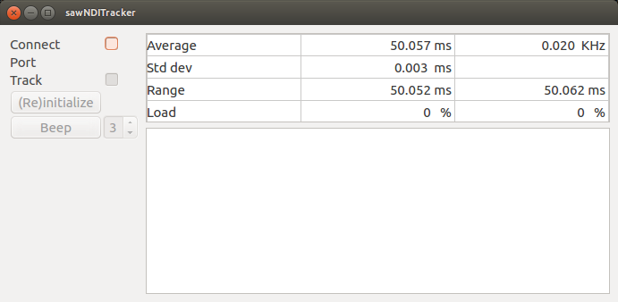
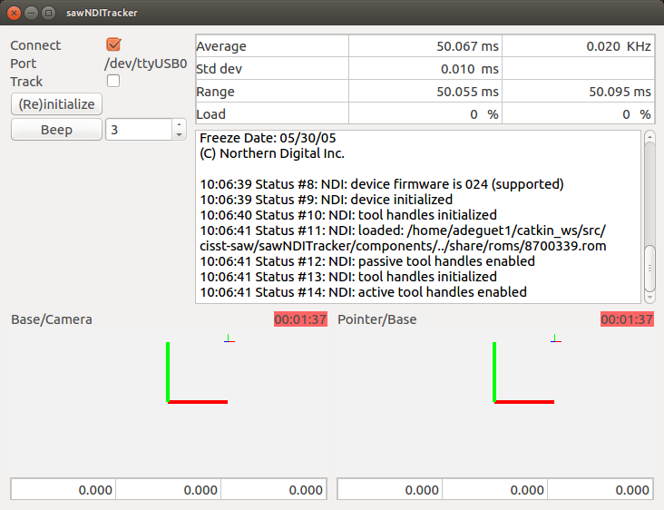
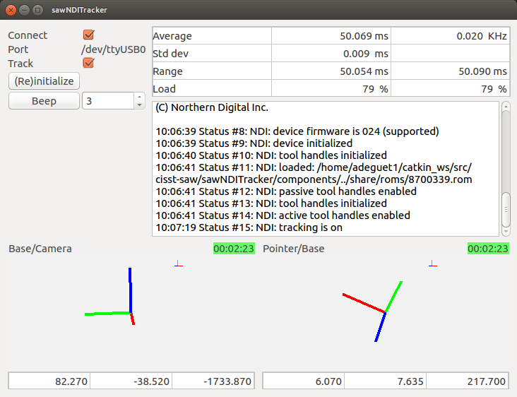

# sawNDITracker

This SAW component contains code for interfacing with many NDI (Northern Digital Inc, https://www.ndigital.com/) trackers. 
It compiles on Windows, Linux and likely MacOS.  It has been tested with:
  * Linux and Windows
  * NDI Polaris (old generation), Spectra and Vicra

The `ros` folder contains code for a ROS node that interfaces with the sawNDITracker component
and publishes the 3D transformations of each tracked tool as well as a point cloud for all stray 
markers.  It also broadcasts transformations for `tf2`.  To build, make sure you use `catkin build`.

If needed, one can also add OpenIGTLink support using sawOpenIGTLink (contact the sawNDITracker developer 
if you need help with this).

# Links
 * License: http://github.com/jhu-cisst/cisst/blob/master/license.txt
 * JHU-LCSR software: http://jhu-lcsr.github.io/software/

# Dependencies
 * cisst libraries: https://github.com/jhu-cisst/cisst
 * Qt for user interface
 * ROS (optional)
 
# Running the examples
 
## Linux permissions
 
NDI communication is basically a serial port.  When connecting your tracker to your computer, a "device" will be added
to the `/dev` directory.   Usually something like `/dev/ttyS01`, `/dev/ttyUSB0` or `/dev/ttyACM0`.  
Check the file permissions on said device, e.g.
```sh
ls -al /dev/ttyUSB0 
crw-rw---- 1 root dialout 188, 0 Jan  3 09:32 /dev/ttyUSB0
```
On Ubuntu, the OS sets the ownership of `/dev/ttyUSB0` to `root` and the group to `dialout`.   To grant permissions to 
read and write to the device, use the command `sudo adduser <user_id> dialout`.   Please note that the user has to 
logout/login for the new group membership to take effect.
 
## Without ROS
 
The main example provided is `sawNDITrackerQtExample`.  The command line options are:
```sh
sawNDITrackerQtExample:
-j <value>, --json-config <value> : json configuration file (optional)
-s <value>, --serial-port <value> : serial port (e.g. /dev/ttyUSB0, COM...) (optional)
-l, --log-serial : log all serial port read/writes in cisstLog.txt (optional)
```

The JSON configuration file is optional.  It can be skipped if all your tools are active (i.e. wired to the tool control
unit).  For active tools, the default names will be based on the tools serial numbers.   If you need a more human readable name, you'll need a JSON configuration files.  If you use any passive tool (i.e. reflective markers for optical trackers), you will need a JSON configuration file.

Some examples of configuration files can be found in the `share` directory.  Here is an example for an active tool and a passive tool used on an older Polaris:
```json
{
    // serial port is optional, if already defined (e.g. command line
    // argument), this will be ignored.  The Connect method will try
    // to automaticaly find the serial port using a regular expresion
    "serial-port": "/dev/ttyUSB0",

    // definition path is a list of directories used to find tool
    // definition files (in order defined in this file).  By default,
    // the search path include the current working directory as well
    // as the source directory with suffix "share/roms" at the tail.
    "definition-path": ["/a_directory", "/another_directory"],

    // list of tools to be tracked
    "tools": [
	    {
	        // active tool
	        "name": "Base",
	        "serial-number": "3288C807"
	    }
        ,
	    {
	        // passive tool, must be defined after Base since it uses Base as reference frame
	        "name": "Pointer",
	        "serial-number": "34801403",
	        "definition": "8700339.rom", // this is a passive tool, the definition has to be provided
            "reference" : "Base"
	    }
    ]
}

```

When starting the example, the GUI will just show the controller view:


The first step is to connect to the device.   If the device is found, the tool widgets will appear:


Then you can start tracking:



## ROS

Please read section above for configuration file description.  The ROS node provided `ndi_tracker` is in the package `ndi_tracker_ros`:
```sh
roscd ndi_tracker_ros
rosrun ndi_tracker_ros ndi_tracker -j ../share/ndi-active-tools.json 
```

The ROS node has a few more command line options:
```sh
/home/adeguet1/catkin_ws/devel_debug/lib/ndi_tracker_ros/ndi_tracker:
 -j <value>, --json-config <value> : json configuration file (optional)
 -s <value>, --serial-port <value> : serial port (e.g. /dev/ttyUSB0, COM...) (optional)
 -l, --log-serial : log all serial port read/writes in cisstLog.txt (optional)
 -n <value>, --ros-namespace <value> : ROS namespace to prefix all topics, must have start and end "/" (default /ndi/) (optional)
 -p <value>, --ros-period <value> : period in seconds to read all components and publish (default 0.02, 20 ms, 50Hz).  There is no point to have a period higher than the tracker's period (optional)
 -P <value>, --tf-ros-period <value> : period in seconds to read all components and broadcast tf2 (default 0.02, 20 ms, 50Hz).  There is no point to have a period higher than the tracker's period (optional)
```

Once the node is started, the following ROS topics should appear:
```sh
/ndi/Base/position_cartesian_current
/ndi/Pointer/position_cartesian_current
/ndi/connect
/ndi/connected
/ndi/fiducials
```


